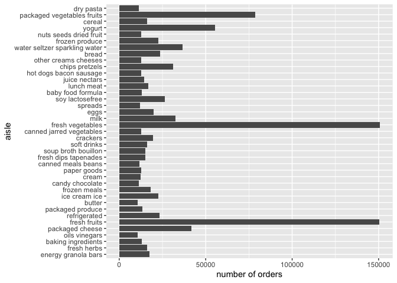

P8105 Homework3
================

``` r
library(tidyverse)
```

    ## ── Attaching packages ─────────────────────────── tidyverse 1.3.0 ──

    ## ✓ ggplot2 3.3.2     ✓ purrr   0.3.4
    ## ✓ tibble  3.0.3     ✓ dplyr   1.0.2
    ## ✓ tidyr   1.1.2     ✓ stringr 1.4.0
    ## ✓ readr   1.3.1     ✓ forcats 0.5.0

    ## ── Conflicts ────────────────────────────── tidyverse_conflicts() ──
    ## x dplyr::filter() masks stats::filter()
    ## x dplyr::lag()    masks stats::lag()

``` r
library(p8105.datasets)
data("instacart")
```

## Problem 1

  - How many aisles are there, and which aisles are the most items
    ordered from?

<!-- end list -->

``` r
instacart %>% 
  group_by(aisle_id, aisle) %>% 
  count(aisle_id, aisle, name = "n_obs") %>% 
  arrange(desc(n_obs))
```

    ## # A tibble: 134 x 3
    ## # Groups:   aisle_id, aisle [134]
    ##    aisle_id aisle                          n_obs
    ##       <int> <chr>                          <int>
    ##  1       83 fresh vegetables              150609
    ##  2       24 fresh fruits                  150473
    ##  3      123 packaged vegetables fruits     78493
    ##  4      120 yogurt                         55240
    ##  5       21 packaged cheese                41699
    ##  6      115 water seltzer sparkling water  36617
    ##  7       84 milk                           32644
    ##  8      107 chips pretzels                 31269
    ##  9       91 soy lactosefree                26240
    ## 10      112 bread                          23635
    ## # … with 124 more rows

There are 134 aisles, and the most items ordered from fresh vegetables.

  - Make a plot that shows the number of items ordered in each aisle,
    limiting this to aisles with more than 10000 items ordered. Arrange
    aisles sensibly, and organize your plot so others can read it.

<!-- end list -->

``` r
instacart %>% 
  group_by(aisle_id, aisle) %>% 
  count(aisle_id, aisle, name = "n_obs") %>% 
  filter(n_obs > 10000) %>% 
  arrange(desc(n_obs)) %>% 
  mutate(aisle = forcats::fct_reorder(aisle, n_obs, .desc = TRUE)) %>% 
  ggplot(aes(x = aisle, y = n_obs)) +
  coord_flip()+
  geom_bar(stat = "identity") +
  labs(y = "number of orders",
       x = "aisle")
```

<!-- -->

\-Make a table showing the three most popular items in each of the
aisles “baking ingredients”, “dog food care”, and “packaged vegetables
fruits”. Include the number of times each item is ordered in your table.

``` r
instacart %>% 
  janitor::clean_names() %>% 
  filter(aisle %in% c("baking ingredients", "dog food care", "packaged vegetables fruits")) %>% 
  group_by(aisle, product_name) %>% 
  summarize(n = n()) %>% 
  filter(n == max(n)) %>% 
  arrange(desc(n)) %>% 
  rename("aisle name" = aisle, "product name" = product_name, 
         "number of order" = n) %>% 
  knitr::kable()
```

    ## `summarise()` regrouping output by 'aisle' (override with `.groups` argument)

| aisle name                 | product name                                  | number of order |
| :------------------------- | :-------------------------------------------- | --------------: |
| packaged vegetables fruits | Organic Baby Spinach                          |            9784 |
| baking ingredients         | Light Brown Sugar                             |             499 |
| dog food care              | Snack Sticks Chicken & Rice Recipe Dog Treats |              30 |
