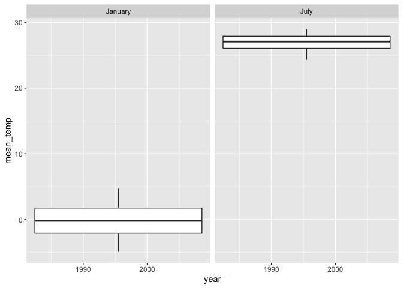

P8105 Homework3
================

``` r
library(tidyverse)
```

    ## ── Attaching packages ─────────────────────────── tidyverse 1.3.0 ──

    ## ✓ ggplot2 3.3.2     ✓ purrr   0.3.4
    ## ✓ tibble  3.0.3     ✓ dplyr   1.0.2
    ## ✓ tidyr   1.1.2     ✓ stringr 1.4.0
    ## ✓ readr   1.3.1     ✓ forcats 0.5.0

    ## ── Conflicts ────────────────────────────── tidyverse_conflicts() ──
    ## x dplyr::filter() masks stats::filter()
    ## x dplyr::lag()    masks stats::lag()

``` r
library(patchwork)
library(p8105.datasets)
data("instacart")
```

## Problem 1

  - How many aisles are there, and which aisles are the most items
    ordered from?

<!-- end list -->

``` r
instacart %>% 
  group_by(aisle_id, aisle) %>% 
  count(aisle_id, aisle, name = "n_obs") %>% 
  arrange(desc(n_obs))
```

    ## # A tibble: 134 x 3
    ## # Groups:   aisle_id, aisle [134]
    ##    aisle_id aisle                          n_obs
    ##       <int> <chr>                          <int>
    ##  1       83 fresh vegetables              150609
    ##  2       24 fresh fruits                  150473
    ##  3      123 packaged vegetables fruits     78493
    ##  4      120 yogurt                         55240
    ##  5       21 packaged cheese                41699
    ##  6      115 water seltzer sparkling water  36617
    ##  7       84 milk                           32644
    ##  8      107 chips pretzels                 31269
    ##  9       91 soy lactosefree                26240
    ## 10      112 bread                          23635
    ## # … with 124 more rows

There are 134 aisles, and the most items ordered from fresh vegetables.

  - Make a plot that shows the number of items ordered in each aisle,
    limiting this to aisles with more than 10000 items ordered. Arrange
    aisles sensibly, and organize your plot so others can read it.

<!-- end list -->

``` r
instacart %>% 
  group_by(aisle_id, aisle) %>% 
  count(aisle_id, aisle, name = "n_obs") %>% 
  filter(n_obs > 10000) %>% 
  arrange(desc(n_obs)) %>% 
  mutate(aisle = forcats::fct_reorder(aisle, n_obs, .desc = TRUE)) %>% 
  ggplot(aes(x = aisle, y = n_obs)) +
  coord_flip()+
  geom_bar(stat = "identity") +
  labs(y = "number of orders",
       x = "aisle")
```

<!-- -->

  - Make a table showing the three most popular items in each of the
    aisles “baking ingredients”, “dog food care”, and “packaged
    vegetables fruits”. Include the number of times each item is ordered
    in your table.

<!-- end list -->

``` r
instacart %>% 
  janitor::clean_names() %>% 
  filter(aisle %in% c("baking ingredients", "dog food care", "packaged vegetables fruits")) %>% 
  group_by(aisle, product_name) %>% 
  summarize(n = n()) %>% 
  filter(n == max(n)) %>% 
  arrange(desc(n)) %>% 
  rename("aisle name" = aisle, "product name" = product_name, 
         "number of order" = n) %>% 
  knitr::kable()
```

    ## `summarise()` regrouping output by 'aisle' (override with `.groups` argument)

| aisle name                 | product name                                  | number of order |
| :------------------------- | :-------------------------------------------- | --------------: |
| packaged vegetables fruits | Organic Baby Spinach                          |            9784 |
| baking ingredients         | Light Brown Sugar                             |             499 |
| dog food care              | Snack Sticks Chicken & Rice Recipe Dog Treats |              30 |

  - Make a table showing the mean hour of the day at which Pink Lady
    Apples and Coffee Ice Cream are ordered on each day of the week;
    format this table for human readers (i.e. produce a 2 x 7 table).

<!-- end list -->

``` r
instacart %>% 
  janitor::clean_names() %>% 
  filter(product_name %in% c("Pink Lady Apples", "Coffee Ice Cream")) %>% 
  select(product_name, order_dow, order_hour_of_day) %>% 
  group_by(product_name,order_dow) %>% 
  summarise(avg_hour = round(mean(order_hour_of_day), 2)) %>% 
  spread(key = order_dow, value = avg_hour) %>% 
  rename("product name" = product_name) %>%
  knitr::kable()
```

    ## `summarise()` regrouping output by 'product_name' (override with `.groups` argument)

| product name     |     0 |     1 |     2 |     3 |     4 |     5 |     6 |
| :--------------- | ----: | ----: | ----: | ----: | ----: | ----: | ----: |
| Coffee Ice Cream | 13.77 | 14.32 | 15.38 | 15.32 | 15.22 | 12.26 | 13.83 |
| Pink Lady Apples | 13.44 | 11.36 | 11.70 | 14.25 | 11.55 | 12.78 | 11.94 |

## Problem 2

  - Load, tidy, and otherwise wrangle the data. Your final dataset
    should include all originally observed variables and values; have
    useful variable names; include a weekday vs weekend variable; and
    encode data with reasonable variable classes. Describe the resulting
    dataset (e.g. what variables exist, how many observations, etc).

<!-- end list -->

``` r
accel_df <- read_csv("./data/accel_data.csv") %>% 
  janitor::clean_names() %>% 
  pivot_longer(
    activity_1:activity_1440,
    names_to = "activity", 
    names_prefix = "activity_", 
    values_to = "counts"
  ) %>% 
  mutate(weekday = case_when(
    day == "Sunday"  | day == "Saturday" ~ "weekend",
    day_id != "Saturday" | day_id != "Sunday" ~ "weekday",
    TRUE ~ ""
  ))
```

    ## Parsed with column specification:
    ## cols(
    ##   .default = col_double(),
    ##   day = col_character()
    ## )

    ## See spec(...) for full column specifications.

I used pivot longer to transform the dataset from a wide form to a long
one, and kept the activity categories and the count of the activity in
different columns. Besides, I also create a new variable to distinguish
weekend and weekday. In my dataset, there are 6 variables: week,
day\_id, day, activity, counts, and weekday, and 50400 observations.

  - Traditional analyses of accelerometer data focus on the total
    activity over the day. Using your tidied dataset, aggregate accross
    minutes to create a total activity variable for each day, and create
    a table showing these totals. Are any trends apparent?

<!-- end list -->

``` r
accel_df %>% 
  group_by(day) %>% 
  summarise(total_activity = sum(counts)) %>% 
  arrange(desc(total_activity))
```

    ## `summarise()` ungrouping output (override with `.groups` argument)

    ## # A tibble: 7 x 2
    ##   day       total_activity
    ##   <chr>              <dbl>
    ## 1 Friday          2291711.
    ## 2 Wednesday       2129772.
    ## 3 Thursday        2091151.
    ## 4 Sunday          1919213 
    ## 5 Monday          1858699.
    ## 6 Tuesday         1799238.
    ## 7 Saturday        1369237

After tidying the dataset, we can find that most activities reside in
weekdays, particularly when approaching weekend and after Wednesday. We
can find the trend that people don’t actually do more activities during
weekend, Monday, and Tuesday as they do in Thursday, Wednesday, and
Friday.

  - Accelerometer data allows the inspection activity over the course of
    the day. Make a single-panel plot that shows the 24-hour activity
    time courses for each day and use color to indicate day of the week.
    Describe in words any patterns or conclusions you can make based on
    this graph.

<!-- end list -->

``` r
accel_df %>% ggplot(aes(x = day, y = counts, color = week)) +
  geom_point(alpha = .5) +
  viridis::scale_color_viridis(name = "week", 
                               discrete = FALSE)
```

<!-- -->
From the scatterplot, we can see the trend that most activities over the
course of the day reside in previous weeks. With the weeks increasing,
the counts start to decrease. Interestingly, people who do activities on
Thursday presume their activity volume even till week 5.

## Problem 3

``` r
library(p8105.datasets)
data("ny_noaa")
```

  - Do some data cleaning. Create separate variables for year, month,
    and day. Ensure observations for temperature, precipitation, and
    snowfall are given in reasonable units. For snowfall, what are the
    most commonly observed values? Why?

<!-- end list -->

``` r
noaa_df <- ny_noaa %>% 
  janitor::clean_names() %>% 
  separate(date, c("year", "month", "day"), sep = "-") %>% 
  mutate(tmax = as.double(tmax) / 10, 
         tmin = as.double(tmin) / 10, 
         prcp = prcp / 10,
         month = month.name[as.integer(month)], 
         year = as.integer(year))
```

For snowfall, the most commonly observed values are 0, as the snowfall
only occurred when the temperature is low enough and the humidity is
abundant enough.

  - Make a two-panel plot showing the average max temperature in January
    and in July in each station across years. Is there any observable /
    interpretable structure? Any outliers?

<!-- end list -->

``` r
noaa_df %>% 
  filter(month %in% c("January", "July")) %>% 
  group_by(year, month) %>% 
  summarise(mean_temp = mean(tmax, na.rm = TRUE)) %>% 
  ggplot(aes(x = year, y = mean_temp)) +
  geom_line(size = 1) +
  facet_grid(.~ month)
```

    ## `summarise()` regrouping output by 'year' (override with `.groups` argument)

<!-- -->

``` r
#Check the outlier with boxplot.
noaa_df %>% 
  filter(month %in% c("January", "July")) %>% 
  group_by(year, month) %>% 
  summarise(mean_temp = mean(tmax, na.rm = TRUE)) %>% 
  ggplot(aes(x = year, y = mean_temp)) +
  geom_boxplot() +
  facet_grid(.~ month)
```

    ## `summarise()` regrouping output by 'year' (override with `.groups` argument)

    ## Warning: Continuous x aesthetic -- did you forget aes(group=...)?

<!-- -->
Based on the plots, we can see that the average max temperature in
January is around 0-5 degree Celsius; while in July, the average
temperature is among 25-30 degree of Celsius. There is no significant
outlier in both of the snowfall in January and July.

  - Make a two-panel plot showing (i) tmax vs tmin for the full dataset
    (note that a scatterplot may not be the best option);

<!-- end list -->

``` r
temp_plot <- noaa_df %>% 
  filter(!is.na(tmin), 
         !is.na(tmax)) %>% 
  pivot_longer(
    tmax:tmin,
    names_to = "observation", 
    values_to = "temperatures"
  ) %>% 
  ggplot(aes(x = temperatures, fill = observation)) +
  geom_density(alpha = .5) +
  labs(title = "Maximum and minimum temperature in NY 1981-2010",
       x = "degree of temperature (C)", 
       y = "density of distribution")
```

and (ii) make a plot showing the distribution of snowfall values greater
than 0 and less than 100 separately by year.

``` r
snow_plot <- noaa_df %>% 
  filter(snow > 0 & snow < 100) %>% 
  mutate(year_cat = cut(year, breaks = c(1980, 1985, 1990, 1995, 2000, 2005, 2010), right = FALSE, labels = FALSE)) %>%
  mutate(year_cat = recode(year_cat, `1` = "1981-1985",
                                     `2` = "1986-1990",
                                     `3` = "1991-1995",
                                     `4` = "1996-2000",
                                     `5` = "2001-2005",
                                     `6` = "2006-2010")) %>%
  drop_na() %>% 
  ggplot(aes(x = snow, fill = year_cat, color = year_cat)) +
  geom_density(alpha = 0.1) +
  labs(title = "Density plot of Snowfall in NY, 1981-2010", 
       x = "Snowfall (mm)", 
       y = "Density") +
  theme(legend.position = "bottom")

temp_plot + snow_plot
```

<!-- -->
